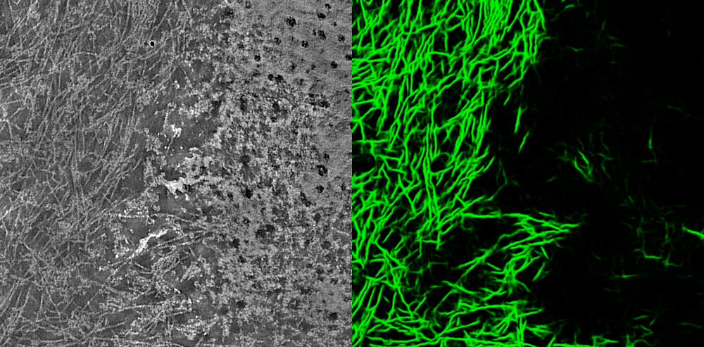
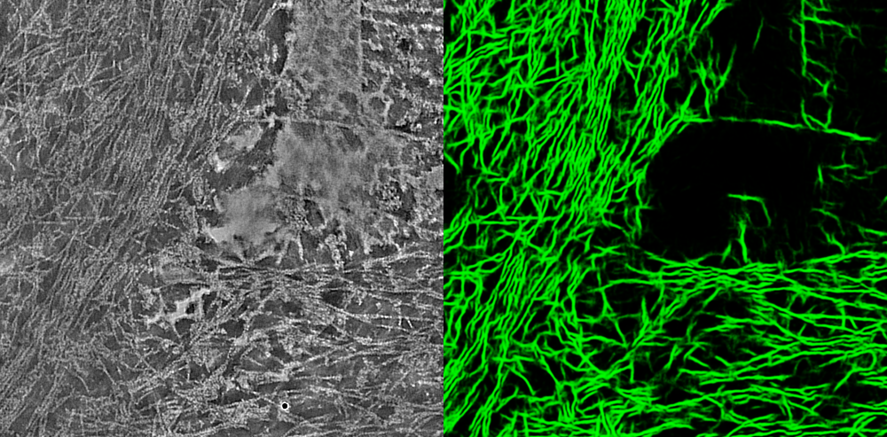
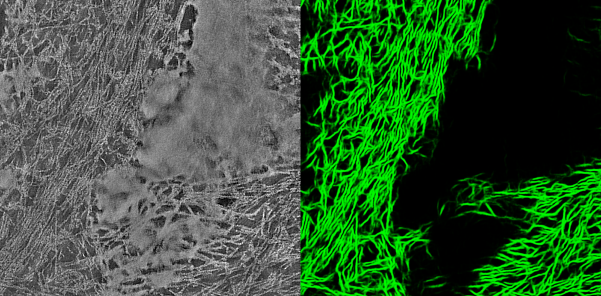

# Detection of actin filaments in electron microscopy images

This project was executed by *Tien Chen Lin* from [*Frank Bradke's Lab*](https://www.dzne.de/en/research/research-areas/fundamental-research/research-groups/bradke/research-areasfocus/) at DZNE Bonn
in collaboration with [*Florian Schur's Lab*](https://schurlab.ist.ac.at/) at IST Austria.

## Objective and outcome

To detect actin filaments in an automated way, the raw images had to be cleaned from dirt, membrane fragments and other experimental artifacts.

Tien Chen trained a model with YAPiC using *unet_2d* for detection of actin filaments (green). Membrane fragments and other experimental artifacts were defined as background.

Look at the three example images below: On the left, you see
  the raw input image. On the right you the the YAPiC output: Actin filaments (green) are enhanced and clearly separated from each
  other. Membrane fragments are filtered out.

## How to proceed from here?

YAPiC is a tool for preprocessing your raw data, i.e, to make
subsequent object detection both easier and more precise.
However, object detection itself is not included in YAPiC. This could be done with thresholding and
[skeletonization](https://imagej.net/Skeletonize3D) in Fiji, or using more advanced tracing algorithms (e.g. on basis of [localized radon transform](https://www.sciencedirect.com/science/article/pii/S1047847712000640))
