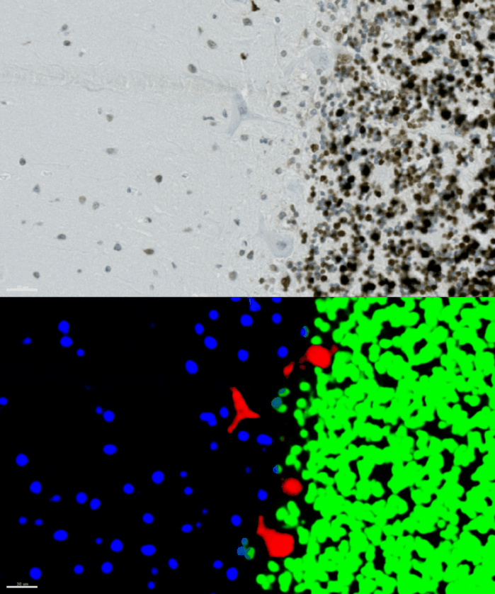
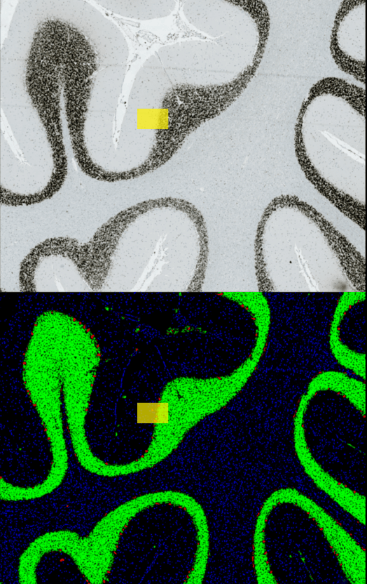
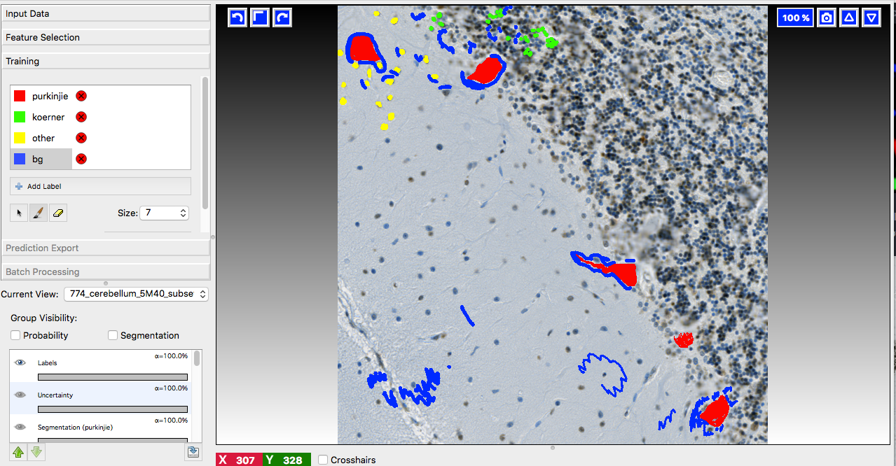
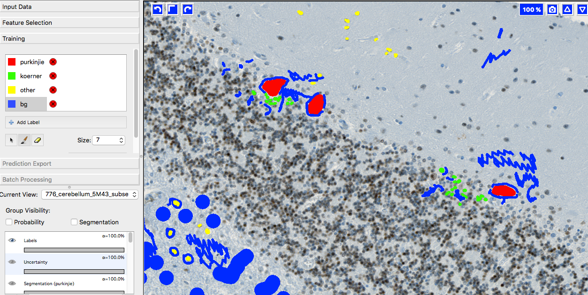
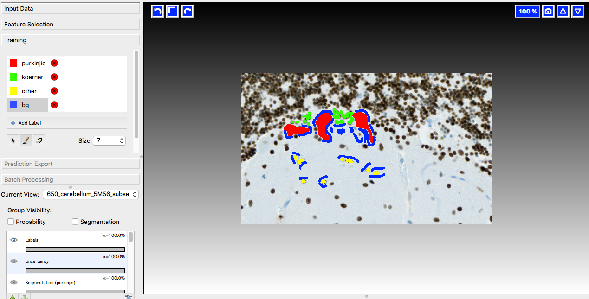
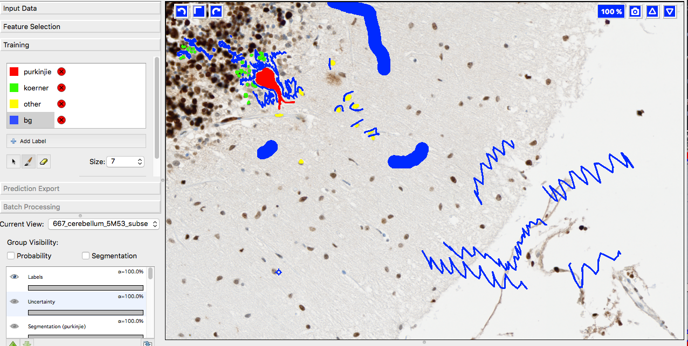

# Detection of purkinje cells in histological brain slices

This project was executed by *Christoph Moehl* (Core Research Facilities, DZNE Bonn) and *Oliver Kaut* (University Clinic Bonn, Dept. of Neurology).

## Objective and outcome

In the following example we aimed to locate and quantify

* individual purkinje cells
* granule cell layer regions
* cells of connective tissue

in human brain slices.

By using *unet_2d* we trained a classifier in YAPiC with 4 classes:

* purkinje cells (red)
* granule cell region (green)
* connective tissue cells (blue)
* background (black)

Look at the image below: On the upper part, you see
the raw input image. Below you see the YAPiC output: The four purkinje cells are clearly enhanced (red signal).

*Histology data by Dr. Oliver Kaut, University Clinic Bonn, Dept. of Neurology*

With YAPiC you can process huge histological datasets in bigtiff format. The image above is just a small subset (the yellow box) of the whole image:

*Histology data by Dr. Oliver Kaut, University Clinic Bonn, Dept. of Neurology*

## How to proceed from here?

You could count and measure individual purkinje cell objects by
using *identifyPrimaryObjects* module of [CellProfiler](https://cellprofiler.org).

## A few words on training data collection

We prepared 36 image subsets from ca 20 different tissue slide scans
and imported them into [ilastik](http://ilastik.org) for labeling. YAPiC
reads label data directly from *ilastik project files (ilp)*.

Below you see 4 examples from the 36 labeled training images.
Note the following about the labeling strategy:
* We did not label whole image. We rather labeled many images sparsely than a few images very densely.
* Borders between classes are clearly defined.
* Amounts of labels are more or less balanced between all classes.

