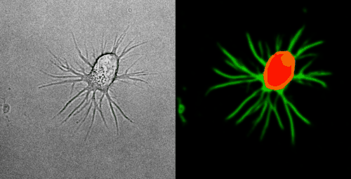
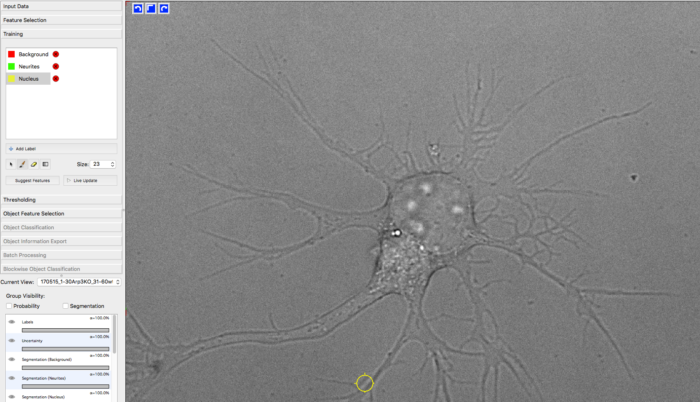
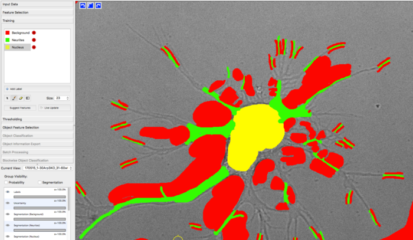

# Detection of neurites and cell soma in phase contrast time lapse movies

This project was executed by *Max Schelski* from [*Frank Bradke's Lab*](https://www.dzne.de/en/research/research-areas/fundamental-research/research-groups/bradke/research-areasfocus/) at DZNE Bonn.

## Objective and outcome

To quantify outgrowth in primary neuronal cells, Max acquired various time
lapse movies in phase contrast.

He trained a model with YAPiC using *unet_2d* for detection of

1. cell soma (red)
1. neurites (green)

The model is quite robust and can be applied to cells of different morphology and varying imaging conditions.

Look at the two example movies below: On the left, you see the input data. On
the right, you see the YAPiC output. We have two channels, one for each
output class (red: cell soma, green: neurite).

## How to proceed from here?

To measure the actual length of neurites, an object detection should be
applied. This could be done with thresholding and
[skeletonization](https://imagej.net/Skeletonize3D) in Fiji,
or by using the AnalyzeSkeleton module of
[CellProfiler](https://cellprofiler.org/).

## A few words on training data collection

* For training the classifier, Max manually labeled approx. 30 images
  (only single time frames) from different samples by using
  [Ilastik](https://ilastik.org). YAPiC reads label data directly from *ilastik project files (ilp)*.

* He defined 3 classes: background (red), neurite (green) and nucleus
(yellow, equivalent to soma).

* Below you see one example of the training images.
  Note the following about the labeling strategy:
    * Max did not label the whole image. He rather labeled many images sparsely
      than a few images very densely.
    * He focussed on heterogeneous regions, such as small cavities and tiny
      processes. Large homogeneous regions, like the background being far away from cell structures can be learned  with very few labels. **Rule of thumb:
      Regions that are hard to label are more important than regions that are easy to label.**
    * Borders between classes are clearly defined.
    * Amounts of labels are well-balanced between all classes.

  
  
  *manually drawn labels in ilastik*
