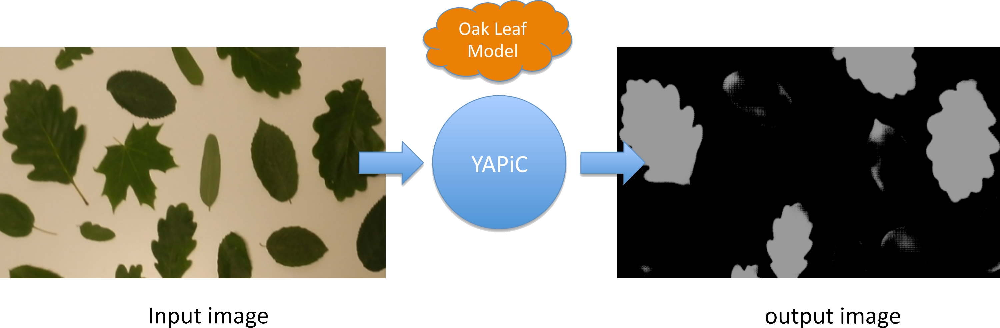
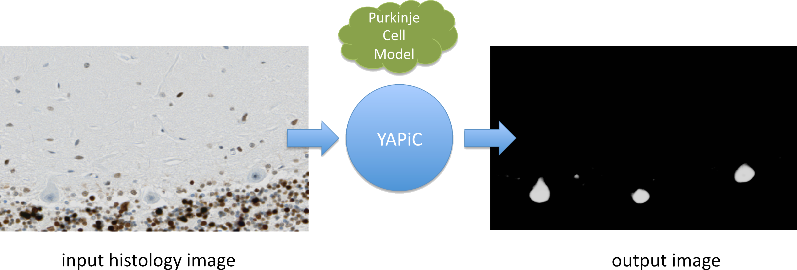

<!-- .element height="40%" width="40%" -->

YAPiC is developed by the
[Image and Data Analysis Facility](https://www.dzne.de/forschung/core-facilities/image-and-data-analysisfacility/),
[Core Reseach Facilities](https://www.dzne.de/forschung/core-facilities/)
of the [DZNE](https://www.dzne.de/en)
(German Center for Neurodegenerative Diseases).
[CLI Documentation](doc_cli.html)
[CLI Documentation](tutorial.html)

## What is YAPiC for?

With YAPiC you can make your own customzied filter (we call it *model* or *classifier*) to enhance a certain structure of your choice.

We can, e.g train a model for detection of oak leafs in color images, and use this oak leaf model to filter out all image regions that are not covered by oak leaves:



* Pixels that belong to other leaf types
  or to no leafs at all are mostly suppressed, they appear dark in the output image.
* Pixels that belong to oak leafs are enhanced, they appear bright in the output image.

The output image is also called a *pobability map*, because the intensity of each pixel corresponds to the probability of the pixel belonging to an oak leave region.

You can train a model for almost any structure you are interested in, for example to detect a certain cell type ist histological micrographs (here: purkinje cells of the human brain):


*Histology data provided by Oliver Kaut (University Clinic Bonn, Dept. of Neurology)*

We have used YAPiC for analyzing various microscopy image data. Our experiments are mainly related to neurobiology, cell biology, histopathology  and drug discovery (high content screening).
However, YAPiC is a very generally applicable tool and can be applied to very different domains. It could be used for detecting e.g. forest regions in satellite images, clouds in landscape photographs or fried eggs in food photography.


## Examples

* [Live cell imaging](example_neurite.html): Detection of neurites in
  label-free time lapse imaging.
* [Digital Pathology](example_histo.html): Detection of specific cell types
  in histological micrographs.
* [Electron Microscopy](example_actin_em.html): Detection of actin filaments in
  transmission electron micrographs.


## Why YAPiC?

Pixel classification in YAPiC is based on deep learning with
*fully convolutional neural networks*.
Development of YAPiC started in 2015, when Ronneberger et al. presented a
[U-shaped fully convolutional neural network](https://arxiv.org/pdf/1505.04597.pdf) that was capable of solving
highly challenging pixel classification tasks in bio images, such as
tumor classification in histological slides or cell segmentation in brightfield
DIC images.

>YAPiC was designed to make this new kind of AI powered pixel
>classification simply applicable,
>i.e **feasible to use for a PhD student** in his/her imaging project.

*Simply applicable* means here in detail:

* Easy to install.
* Working out of the box with 3D multichannel images saved with
  [Fiji](https://fiji.sc).
* Easy collection of label data by utilizing the great
  [Ilastik](https://ilastik.org) user interface.
* Support of sparse labels. From our experience, labels can be collected within
  a few hours by one single person.  
* Simple command line and programming interface (Python).


## How to use it

### Command line interface

#### Model training
```
yapic train unet_2d "path/to/my/images/*.tif" path/to/my/labels.ilp
```
#### Prediction
```
yapic predict my_trained_model.h5 path/to/results/
```

> Get hands on YAPiC with the **[tutorial](tutorial.html)**.

> Go to [CLI Documentation](doc_cli.html) for more details.


### Python API

#### Model training
```python
from yapic.session import Session

img_path = 'path/to/my/images/*.tif'
label_path = 'path/to/my/labels.ilp'

model_size_zxy = (5, 572, 572)

t = Session()
t.load_training_data(img_path, label_path)
t.make_model('unet_multi_z', model_size_zxy)

t.define_validation_data(0.2) # 80% training data, 20% validation data

t.train(max_epochs=5000,
        steps_per_epoch=48,
        log_filename='log.csv')

t.model.save('my_model.h5')
```


#### Prediction
```python
from yapic.session import Session

img_path = 'path/to/my/images/*.tif'
results_path = 'path/to/my/results/'

t = Session()
t.load_prediction_data(img_path, results_path)
t.load_model('my_model.h5')

t.predict() # applies the classfier to all images in img_path
```

> Try it out with the [leaves example dataset](example_data/leaves_example_data.zip)


## How to install

### Linux

* Install [Python 3.6.](https://www.python.org/downloads/)

* Update *pip* and *setuptools*
  ```
  pip install --upgrade pip setuptools
  ```

* Install [Tensorflow](https://www.tensorflow.org/)

  * We strongly recommend to install a Tensorflow version with GPU support.  
    CPU is too slow for model training.
  * Please read [Tensorflow installation instructions](https://www.tensorflow.org/install/gpu) to set up CUDA drivers, cuDNN etc. correctly.
  * Supported **Tensorflow versions** are **1.12, 1.13, 1.14, 1.15** and **2.1**.
  * To be able to **export YAPiC models to ImageJ** ([DeepImageJ Plugin version 1.0.1](https://deepimagej.github.io/deepimagej/)), you have install
    Tensorflow version **1.13.1**.
    ```
    pip install tensorflow-gpu==1.13.1
    ```
    **Hint**: You can make different [virtual environments](https://docs.python.org/3.6/library/venv.html) with different Tensorflow versions for model training and ImageJ export.
    * You can train your model with an environment where```tensorflow-gpu==2.1``` is installed. If you have a very recent GPU, this may increase training speed compared to older Tensorflow versions.
    * For exporting the model to ImageJ, you can switch to an environment with ```tensorflow==1.13.1``` (GPU support is not necessary for just exporting the model).     


* Install YAPiC

```
pip install yapic
```


### Windows and Mac

YAPiC is currently only supported on Linux. It runs in principle on Mac OS,
but installing Tensorflow with GPU support in currently [not that straightforward
on Mac OS](https://docs.anaconda.com/anaconda/user-guide/tasks/tensorflow/).
We may release Docker images in the future to run YAPiC easily in Windows and
Mac workstations.


## Hardware Recommendations

YAPiC is designed to run on dedicated hardware. In production, it
should not run on your everyday-work notebook, but on a dedicated workstation or a
server. The reason is, that training a model requires long time (multiple hours
to multiple days) and a lot of computing power. Running these processes in the
background on your notebook while e.g. writing E-Mails is not feasible. Moreover, you will need powerful GPU hardware that is normally not available on office notebooks.   


* Using fast SSD hard drives (PCIe SSDs) for storing training data may increase
  training speed, compared to conventional hard drives. Have a look at the [GPU requirements for Tensorflow](https://www.tensorflow.org/install/gpu)
* From our expericence you can have already quite good performance with NVIDIA Geforce
  boards (mainly intended for gaming). These are cheaper than professional
  NVIDIA Tesla GPUs.
* GPU RAM requirements: RAM of your GPU hardware is often a bottleneck and depends the specific project. RAM requirements depend on the number of classes you want to train
  and if you use a 2D network or 3D network. Some recommendations, based on our
  personal experience:

  * For training a *unet_2D* with two classes (foreground, background), 5 GB
    RAM on your GPU is sufficient.
  * For training a *unet_multi_z* with five z-layers and two classes, 11 GB RAM
    on GPU is sufficient.
