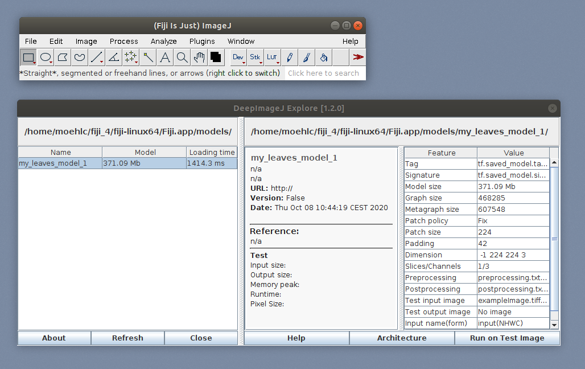
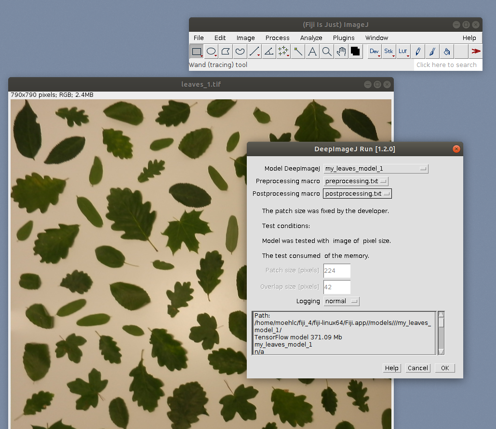
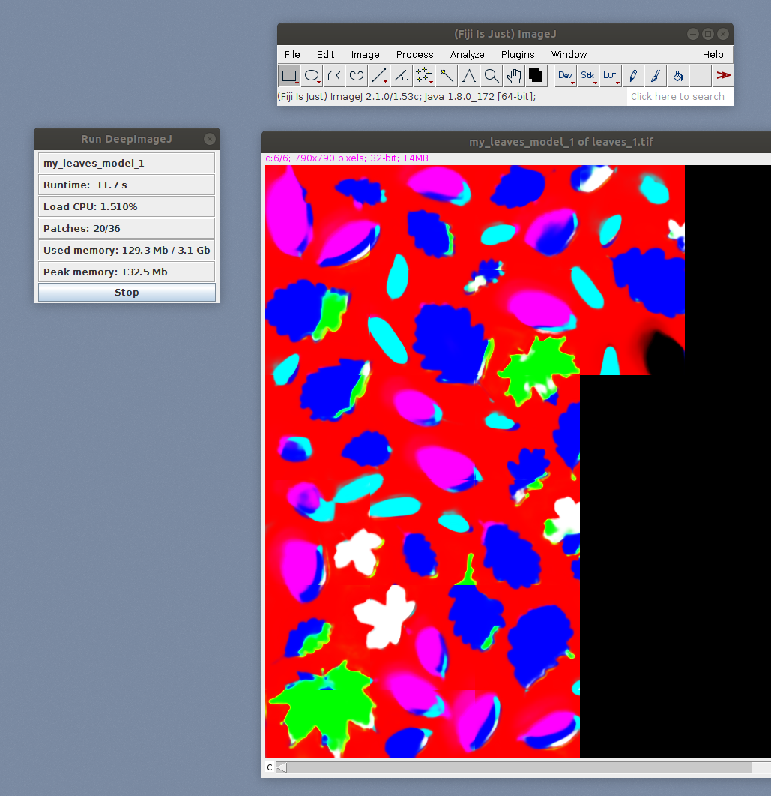

# Tutorial Part II: Apply the model in Fiji using DeepImageJ plugin

In the [first part](tutorial.html) we learned how to train and apply a model with the YAPiC command line tool. Besides of using YAPiC for prediction, we can export the model to a bundled model that is ready to use in ImageJ's DeepimageJ plugin.

## Preparation

Install [Fiji](https://fiji.sc) and the [DeepImageJ plugin](https://deepimagej.github.io).

## Export your Model with YAPiC to a DeepImageJ BundledModel

To be able to load the model into DeepImageJ, you have to convert it with YAPiC's deploy option. To be able to **export YAPiC models to ImageJ** ([DeepImageJ Plugin version 1.2](https://deepimagej.github.io/deepimagej/)), you have use **Tensorflow version 1.15**.

```
yapic deploy model.h5 path/to/example_image/leaves_1.tif path/to/fiji_installation/models/my_leaves_model_1 --skip-predict
```

The command converts the Keras model file into a **DeepImageJ bundled model** with all necessary metadata, example images and conversion scripts included. **The model can be directly applied in DeepImageJ**. There is no need of executing `DeepImageJ:Build BundledModel` inside ImageJ.

* `model.h5` specifies the model file name to be exported.
* `path/to/example_image/leaves_1.tif` specifies a path to an example input image. This image will be converted and packed into the DeepImageJ model and serves as a test and preview image in the DeepImageJ user interface.
* `path/to/fiji_installation/models/my_leaf_model` specifies the path where the model is exported to. DeepImageJ reads all model data from a folder with name `models` in the fiji installation path. If the `models` directory does not exist, you have to create it first.
* `--skip-predict` deactivates the creation of a result image. The result image is optional. If activated, the prediction appears as a preview in DeepImageJ plugin.

There are several optional parameters to add metadata to the model (e.g. author information):

```
--author=AUTHOR         Name of the model's authors [default: n/a]
--url=URL               Url to model publication [default: http://]
--credit=CREDIT         [default: n/a]
--mdversion=MDVERSION   Model version [default: n/a]
--reference=REFERENCE   Publication reference of model [default: n/a]
```
This is of particular interest if you would like to publish the model on the [model repository](https://deepimagej.github.io/deepimagej/models.html).

## Open and Apply the Model in Fiji

1. Open Fiji
1. Go to `Plugins>>DeepImageJ>>DeepImageJ Explore`
1. Your model with name `my_leaves_model_1` is listed. For a quick test, you   can apply you model to the test image, which is bundled with the model.
   
1. To apply the model to another image, open your image of choice and run `Plugins>>DeepImageJ>>DeepImageJ Run`.

    * Select your model.
    * Set the preprocessing and postprocessing macros as shown in the screenshot. The macros are included in the bundled model (they were generated with the `yapic deploy` command you applied earlier).
1. Hit `OK` to start prediction.

